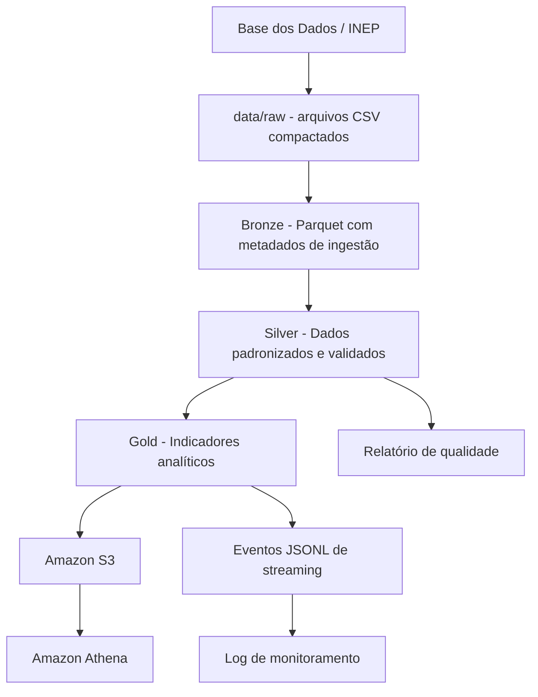

# Pipeline de Alfabetização no Brasil

Projeto desenvolvido para o Tech Challenge — Fase 2 da pós-graduação em AI Scientist.

## Contexto do problema

A alfabetização na idade certa é um dos principais desafios da educação básica no Brasil. Quando uma criança não desenvolve habilidades adequadas de leitura e escrita nos primeiros anos escolares, isso pode impactar seu desempenho nas próximas etapas da trajetória escolar.

Neste projeto, a proposta é construir uma pipeline de dados para organizar, tratar e disponibilizar informações relacionadas ao indicador de alfabetização. A ideia é transformar dados brutos em bases analíticas que possam apoiar análises sobre desempenho educacional, metas de alfabetização e desigualdades entre unidades da federação.

## Desafio educacional

O desafio utiliza dados oficiais relacionados à avaliação da alfabetização no Brasil. O indicador de alfabetização permite observar o percentual de alunos considerados alfabetizados, além de métricas como média de proficiência em Língua Portuguesa e metas de alfabetização.

A partir desses dados, é possível responder perguntas como:

- quais UFs estão mais distantes das metas de alfabetização;
- quais redes apresentam melhores ou piores resultados;
- quais estados estão acima ou abaixo da referência nacional;
- como os dados tratados poderiam apoiar decisões de políticas públicas.

## Objetivo do projeto

O objetivo do projeto é construir uma pipeline de dados em arquitetura Medalhão, utilizando camadas Bronze, Silver e Gold, com ingestão batch, simulação de streaming, validações de qualidade, monitoramento, implementação em cloud e boas práticas de FinOps.

## Escopo do projeto

As tabelas escolhidas para o MVP são:

- `uf`: resultados observados da alfabetização por unidade da federação e rede de ensino;
- `meta_alfabetizacao_uf`: metas de alfabetização por UF até 2030;
- `meta_alfabetizacao_brasil`: metas e resultado consolidado em nível nacional.

Essa escolha permite analisar a situação da alfabetização no Brasil a partir de três pontos:

- resultado observado;
- distância em relação às metas;
- comparação com o cenário nacional.

As tabelas em nível municipal e de alunos foram consideradas, mas não foram usadas nesta primeira versão para evitar aumento excessivo de volume, custo e complexidade.

## Arquitetura proposta

A solução foi organizada seguindo a Arquitetura Medalhão:

- **Bronze**: armazenamento dos dados próximos da fonte original;
- **Silver**: padronização, organização e validação dos dados;
- **Gold**: criação de tabelas finais com indicadores analíticos.

Além disso, a solução inclui:

- simulação de eventos streaming;
- logs de monitoramento da pipeline;
- armazenamento em AWS S3;
- consulta das tabelas Gold com Amazon Athena.

## Diagrama da pipeline



## Fluxo de dados

O fluxo da pipeline funciona da seguinte forma:

1. Os arquivos CSV compactados são baixados da Base dos Dados e armazenados em `data/raw`.
2. A etapa Bronze lê os arquivos brutos e salva os dados em Parquet, adicionando metadados de ingestão.
3. A etapa Silver padroniza nomes, tipos de dados e executa validações de qualidade.
4. A etapa Gold gera tabelas finais com indicadores de alfabetização e comparação com metas.
5. A etapa de streaming simula eventos operacionais da pipeline em formato JSONL.
6. O monitoramento gera um log tabular com status, etapa, tabela e registros processados.
7. As camadas são enviadas para o Amazon S3.
8. As tabelas Gold são disponibilizadas no Amazon Athena para consulta analítica.

## Estrutura utilizada pela pipeline

A estrutura abaixo representa os arquivos versionados no repositório e as pastas utilizadas ou geradas durante a execução da pipeline.

```bash
data/
├── raw/
├── bronze/
├── silver/
├── gold/
├── streaming/      # gerada durante a simulação de streaming
└── monitoring/     # gerada durante o monitoramento

notebooks/
└── 01_exploracao_base_alfabetizacao.ipynb

src/
├── ingest_bronze.py
├── transform_silver.py
├── transform_gold.py
└── simulate_streaming_monitoring.py

sql/
└── create_athena_tables.sql
```

Os arquivos de dados e os arquivos gerados pela pipeline não são versionados no GitHub.

## Dados utilizados

Os dados foram obtidos a partir da Base dos Dados, no conjunto **Avaliação da Alfabetização**, disponível em:

```text
https://basedosdados.org/dataset/073a39d4-89cf-4068-b1e8-34ed0d9c0b72?table=e1de7a6a-5038-4e81-89f0-a15f2cc12c9b
```

As tabelas utilizadas no MVP foram baixadas manualmente em formato CSV compactado e armazenadas localmente na pasta `data/raw`.

Os arquivos esperados na pasta `data/raw` são:

```bash
br_inep_avaliacao_alfabetizacao_uf.csv.gz
br_inep_avaliacao_alfabetizacao_meta_alfabetizacao_uf.csv.gz
br_inep_avaliacao_alfabetizacao_meta_alfabetizacao_brasil.csv.gz
```

## Tecnologias utilizadas

| Tecnologia | Uso no projeto | Justificativa |
|---|---|---|
| Python | Desenvolvimento dos scripts da pipeline | Linguagem simples, flexível e adequada para processamento de dados |
| Pandas | Leitura, transformação e validação dos dados | Facilita a manipulação das tabelas no escopo do MVP |
| Parquet | Armazenamento nas camadas Bronze, Silver e Gold | Formato mais eficiente para consulta e armazenamento do que CSV |
| JSONL | Simulação de eventos streaming | Formato simples para representar eventos operacionais da pipeline |
| Git e GitHub | Versionamento do projeto | Permite acompanhar a evolução da solução com commits, branches e PRs |
| AWS S3 | Armazenamento em cloud | Serviço simples e adequado para estruturar um data lake em arquivos |
| Amazon Athena | Consulta analítica das tabelas Gold | Permite consultar arquivos Parquet no S3 usando SQL |

## Pipeline Bronze

A primeira etapa da pipeline realiza a ingestão dos arquivos brutos da pasta `data/raw` e salva os dados em formato Parquet na pasta `data/bronze`.

Nesta camada, os dados são mantidos próximos da fonte original. As únicas alterações adicionadas são metadados de ingestão:

- `data_ingestao`: data e hora em que o arquivo foi processado;
- `arquivo_origem`: nome do arquivo original utilizado na ingestão.

Para executar a etapa Bronze:

```bash
python src/ingest_bronze.py
```

## Pipeline Silver

A etapa Silver realiza a padronização das tabelas geradas na camada Bronze e cria um relatório simples de qualidade dos dados.

Nesta camada foram aplicadas transformações como:

- padronização de tipos de dados;
- renomeação de colunas para deixar o significado mais claro;
- preservação dos códigos de `rede` e `serie` quando o dicionário oficial não estava disponível;
- validação de duplicidades nas chaves principais;
- validação de percentuais no intervalo de 0 a 100.

O relatório de qualidade é salvo em:

```bash
data/silver/quality_report_silver.csv
```

Para executar a etapa Silver:

```bash
python src/transform_silver.py
```

## Pipeline Gold

A etapa Gold gera as tabelas finais de indicadores para análise da alfabetização.

Nesta camada foram criadas duas saídas principais:

- `indicadores_alfabetizacao_uf`: tabela com taxa de alfabetização, média de português, distância em relação ao ponto de corte de 743 pontos e status da UF em relação a esse ponto de corte;
- `comparativo_metas_uf_brasil`: tabela com comparação entre taxa observada, meta de alfabetização da UF e referência nacional.

A tabela de indicadores considera o ponto de corte de 743 pontos citado no desafio como referência para classificar a proficiência média.

Alguns registros permanecem com valores nulos quando a fonte original não possui meta ou resultado disponível para aquele ano ou UF. Esses casos são mantidos para preservar a rastreabilidade da informação original.

Para executar a etapa Gold:

```bash
python src/transform_gold.py
```

## Streaming e Monitoramento

Como os dados oficiais de alfabetização são publicados de forma periódica, a ingestão principal foi tratada como batch.

Para representar a parte streaming, foi criada uma simulação de eventos operacionais da pipeline. Esses eventos representam situações que poderiam ser enviadas para uma fila ou tópico em uma arquitetura real.

O script `simulate_streaming_monitoring.py` gera eventos em formato JSONL para situações como:

- ingestão Bronze concluída;
- transformação Silver concluída;
- validação de qualidade concluída;
- atualização das tabelas Gold;
- execução geral da pipeline finalizada.

Além dos eventos JSONL, também é gerado um log tabular de monitoramento com informações como etapa, status, tabela processada e quantidade de registros.

Arquivos gerados:

```bash
data/streaming/pipeline_events.jsonl
data/monitoring/pipeline_monitoring_log.csv
```

Para executar a simulação de streaming e monitoramento:

```bash
python src/simulate_streaming_monitoring.py
```

## Qualidade dos dados

Nesta primeira versão, as validações de qualidade foram aplicadas na camada Silver.

As regras implementadas verificam:

- duplicidade nas chaves principais de cada tabela;
- percentuais fora do intervalo esperado de 0 a 100.

O resultado das validações é salvo em:

```bash
data/silver/quality_report_silver.csv
```

Na execução testada, as regras de qualidade retornaram status `ok`.

## Como executar a pipeline

Crie e ative o ambiente virtual:

```bash
python3 -m venv .venv
source .venv/bin/activate
```

Instale as dependências:

```bash
pip install -r requirements.txt
```

Com o ambiente virtual ativado, execute os scripts na seguinte ordem:

```bash
python src/ingest_bronze.py
python src/transform_silver.py
python src/transform_gold.py
python src/simulate_streaming_monitoring.py
```

## Implementação em Cloud

A implementação em cloud foi feita na AWS, utilizando o Amazon S3 para armazenar as camadas da pipeline e o Amazon Athena para consultar as tabelas finais da camada Gold.

As camadas foram organizadas no S3 da seguinte forma:

```bash
s3://pipeline-alfabetizacao-brasil-vitoria-20260830/raw/
s3://pipeline-alfabetizacao-brasil-vitoria-20260830/bronze/
s3://pipeline-alfabetizacao-brasil-vitoria-20260830/silver/
s3://pipeline-alfabetizacao-brasil-vitoria-20260830/gold/
s3://pipeline-alfabetizacao-brasil-vitoria-20260830/streaming/
s3://pipeline-alfabetizacao-brasil-vitoria-20260830/monitoring/
```

As tabelas Gold foram disponibilizadas no Athena como tabelas externas apontando para os arquivos Parquet armazenados no S3.

Os comandos SQL usados para criar o banco e as tabelas no Athena estão em:

```bash
sql/create_athena_tables.sql
```

As tabelas criadas no Athena foram:

- `alfabetizacao_brasil.indicadores_alfabetizacao_uf`;
- `alfabetizacao_brasil.comparativo_metas_uf_brasil`.

## Decisões arquiteturais

### Batch vs Streaming

Os dados oficiais de alfabetização são publicados de forma periódica, por isso a ingestão principal foi implementada em batch.

A parte streaming foi representada por eventos operacionais da pipeline. Essa escolha evita simular uma mudança em tempo real nos dados educacionais que, na prática, não são atualizados continuamente. Ao mesmo tempo, permite demonstrar como a arquitetura poderia acompanhar eventos de execução, validação e atualização das camadas.

### Data Lake vs Data Warehouse

A solução usa uma abordagem de data lake no Amazon S3, com dados organizados em camadas e armazenados em arquivos.

Essa escolha foi feita porque o S3 permite armazenar diferentes camadas de dados com baixo custo e simplicidade. Para consulta analítica, foi usado o Athena, que permite consultar os arquivos Parquet diretamente no S3 usando SQL, sem precisar manter um banco de dados ou cluster ligado o tempo todo.

### Custo vs Performance

O projeto prioriza uma solução simples e de baixo custo, adequada ao ambiente AWS Academy.

O uso de Parquet melhora a performance das consultas e reduz o volume de dados lido pelo Athena. Além disso, a solução evita recursos persistentes mais caros, como EC2, EMR, Glue Jobs ou clusters sempre ativos.

## Monitoramento e FinOps

O monitoramento foi implementado por meio de eventos JSONL e um log tabular da execução da pipeline.

O log registra informações como:

- etapa executada;
- status da execução;
- tabela processada;
- quantidade de registros;
- resultado das validações de qualidade.

Para controle de custos, foram adotadas as seguintes práticas:

- uso de arquivos Parquet;
- separação dos dados em camadas;
- uso do S3 como armazenamento principal;
- uso do Athena somente para consulta das tabelas finais;
- manutenção de baixo volume de dados no MVP;
- ausência de recursos persistentes mais caros;
- desativação de versionamento no bucket;
- bloqueio de acesso público ao bucket.

Essas escolhas ajudam a manter o projeto mais simples, reprodutível e compatível com o ambiente AWS Academy.

## Aplicação em IA

A camada Gold foi construída para servir como base analítica e também como possível entrada para aplicações de IA.

Alguns usos possíveis são:

### Modelos de predição de alfabetização

A tabela Gold poderia ser usada para treinar modelos que estimem a taxa de alfabetização ou a chance de uma UF atingir determinada meta. Variáveis como ano, UF, rede, taxa observada, média de português, distância para o ponto de corte e distância para a meta poderiam ser usadas como features.

### Análise de desigualdade educacional

Os dados tratados permitem comparar resultados entre UFs e redes de ensino. Isso pode apoiar análises sobre desigualdade territorial, identificando regiões com maior distância em relação às metas ou ao resultado nacional.

### Políticas públicas baseadas em dados

A base Gold pode apoiar a priorização de políticas públicas, indicando quais UFs estão mais distantes das metas de alfabetização e onde ações educacionais poderiam ser acompanhadas com mais atenção.

## Boas práticas de Git

O projeto foi desenvolvido utilizando branches separadas por etapa, com commits e Pull Requests para organizar a evolução da solução.

Principais etapas versionadas:

- configuração inicial do projeto;
- pipeline Bronze;
- pipeline Silver e qualidade;
- pipeline Gold;
- streaming e monitoramento;
- documentação de AWS, Athena e FinOps;
- revisão final do README.

## Observações e limitações

Os arquivos de dados brutos e os arquivos gerados nas camadas Bronze, Silver, Gold, Streaming e Monitoring não são versionados no GitHub, seguindo boas práticas para projetos de dados.

A coluna `rede` possui dicionário oficial indicado pela Base dos Dados, mas a tabela de tradução não pôde ser acessada via download manual. Por isso, nesta versão do projeto, os códigos da tabela `uf` foram preservados sem tradução.

A parte de streaming foi implementada como uma simulação de eventos operacionais da pipeline, pois os dados oficiais de alfabetização são publicados de forma periódica e não representam um fluxo contínuo em tempo real.

As tabelas municipais e de alunos podem ser incorporadas em uma evolução futura do projeto, caso seja necessário um nível maior de granularidade.